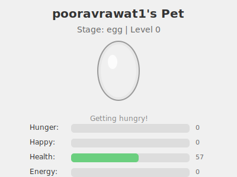

# GitHub Tamagotchi

A web service that generates dynamic SVG pet widgets based on GitHub activity. Embed a virtual pet in your GitHub profile README that evolves and responds to your coding activity.

**Example — this repo's pet** (updates from the repo owner's GitHub activity):



_The pet above is generated by the [update-pet workflow](.github/workflows/update-pet.yml). Run it once (Actions → "Update GitHub Tamagotchi Pet" → Run workflow) if the image is missing._

## Add to your profile (anyone can use this)

Two ways to show the pet on your profile: **GitHub Actions** (no server, no PAT) or a **public instance** (one-line embed).

---

### Option A: GitHub Actions (recommended — no server or token needed)

The pet is generated in your profile repo by a workflow using GitHub’s built-in token. No deployment and no Personal Access Token.

1. **Create a profile README** if you don’t have one: create a repo named exactly `YOUR_GITHUB_USERNAME`, add a `README.md`.

2. **Add the workflow** — create `.github/workflows/pet.yml` in that repo:

   ```yaml
   name: Update GitHub Tamagotchi Pet

   on:
     schedule:
       - cron: "0 */6 * * *" # every 6 hours
     workflow_dispatch: # allow manual run

   permissions:
     contents: write

   jobs:
     pet:
       runs-on: ubuntu-latest
       steps:
         - uses: actions/checkout@v4
         - uses: YOUR_USERNAME/gh-tamagotchi/.github/actions/generate-pet@main
           with:
             github-token: ${{ secrets.GITHUB_TOKEN }}
             # username defaults to repository owner (your profile username)
   ```

   Replace `YOUR_USERNAME` with the GitHub org/user that hosts the `gh-tamagotchi` repo (or use that repo’s full path).

3. **Show the pet in your README** — the action writes `pet.svg` (and `.pet-state.json`) into your repo. In `README.md`:

   ```markdown
   
   ```

4. **Run the workflow** once (Actions → “Update GitHub Tamagotchi Pet” → “Run workflow”) or wait for the schedule. The pet will update from your GitHub activity (commits, PRs).

**How it gets your data:** The workflow uses `secrets.GITHUB_TOKEN`, which has access to the repository. The generator script uses that token to call GitHub’s API for **public** contribution and activity data for the repo owner (you). No PAT or deployment required.

---

### Option B: Public instance (one-line embed)

If a public instance is available (e.g. after [deploying on Render](#render)), anyone can embed it with a URL:

1. Create a profile repo and `README.md` as above.
2. In `README.md`:

   ```markdown
   
   ```

3. Replace the URL with the instance’s base URL and your username.

**Using your own instance?** Deploy once (e.g. [Render](#render)), then use your app URL in the image link. You can share that URL so others can use it without deploying.

## Features

- **Dynamic Pet Widget**: SVG-based pet that changes appearance based on your GitHub activity
- **Real-time Stats**: Hunger, happiness, health, and energy stats that decay over time
- **Activity Rewards**: Commits and pull requests boost your pet's stats
- **Evolution System**: Pet evolves through 5 stages (egg → baby → teen → adult → legendary)
- **Embeddable**: Works with standard markdown image syntax in GitHub READMEs
- **Fast & Cached**: Responses under 100ms with intelligent caching

## Quick Start

### Prerequisites

- Python 3.11+
- GitHub Personal Access Token (for API access)

### Local Development

1. Clone the repository:

```bash
git clone https://github.com/yourusername/github-tamagotchi.git
cd github-tamagotchi
```

2. Create a virtual environment:

```bash
python -m venv venv
source venv/bin/activate  # On Windows: venv\Scripts\activate
```

3. Install dependencies:

```bash
pip install -r requirements.txt
```

4. Configure environment variables:

```bash
cp .env.example .env
```

5. Edit `.env` and add your GitHub token:

```bash
GITHUB_TOKEN=ghp_your_github_token_here
```

6. Run the application:

```bash
uvicorn api.main:app --reload
```

The API will be available at `http://localhost:8000`

### Testing

Run all tests:

```bash
pytest
```

Run with coverage:

```bash
pytest --cov=. --cov-report=term-missing
```

## Environment Variables

| Variable             | Required | Default                          | Description                                         |
| -------------------- | -------- | -------------------------------- | --------------------------------------------------- |
| `GITHUB_TOKEN`       | Yes      | -                                | GitHub Personal Access Token for API authentication |
| `GITHUB_GRAPHQL_URL` | No       | `https://api.github.com/graphql` | GitHub GraphQL API endpoint                         |
| `GITHUB_REST_URL`    | No       | `https://api.github.com`         | GitHub REST API endpoint                            |
| `DATABASE_URL`       | No       | `sqlite:///./pets.db`            | Database connection URL                             |
| `CACHE_TTL_SECONDS`  | No       | `300`                            | Cache time-to-live in seconds (5 minutes)           |
| `HOST`               | No       | `0.0.0.0`                        | Server host address                                 |
| `PORT`               | No       | `8000`                           | Server port                                         |
| `LOG_LEVEL`          | No       | `INFO`                           | Logging level (DEBUG, INFO, WARNING, ERROR)         |

### Game Engine Configuration (Optional)

These variables control pet stat decay and activity boosts:

```bash
# Decay rates (per hour)
HUNGER_DECAY_RATE=2.0
HAPPINESS_DECAY_RATE=3.0
ENERGY_DECAY_RATE=1.5
HEALTH_DECAY_RATE=0.5

# Activity boosts
COMMIT_HUNGER_BOOST=10
COMMIT_HAPPINESS_BOOST=5
PR_MERGED_HAPPINESS_BOOST=10
PR_MERGED_XP_BOOST=20

# Inactivity penalties
INACTIVE_DAYS_THRESHOLD=3
INACTIVE_HAPPINESS_PENALTY=15
INACTIVE_ENERGY_PENALTY=10
```

## API Endpoints

### GET /pet

Returns an SVG image of your pet widget.

**Query Parameters:**

- `user` (required): GitHub username

**Example:**

```bash
curl "http://localhost:8000/pet?user=octocat"
```

**Response:**

- Content-Type: `image/svg+xml`
- Status: 200 (success), 404 (user not found), 500 (error)

**Embed in GitHub README:**

```markdown

```

### GET /stats

Returns JSON data of your pet's current stats.

**Query Parameters:**

- `user` (required): GitHub username

**Example:**

```bash
curl "http://localhost:8000/stats?user=octocat"
```

**Response:**

```json
{
  "username": "octocat",
  "hunger": 45,
  "happiness": 72,
  "health": 95,
  "energy": 68,
  "level": 5,
  "xp": 520,
  "stage": "teen",
  "last_updated": "2024-02-13T10:30:45.123456"
}
```

### GET /health

Health check endpoint for deployment monitoring.

**Example:**

```bash
curl "http://localhost:8000/health"
```

**Response:**

```json
{
  "status": "healthy"
}
```

## Deployment

### Docker

Build the Docker image:

```bash
docker build -t github-tamagotchi .
```

Run the container:

```bash
docker run -p 8000:8000 \
  -e GITHUB_TOKEN=your_token_here \
  -e DATABASE_URL=sqlite:///./pets.db \
  github-tamagotchi
```

### Render

The repo includes a `render.yaml` blueprint so Render can auto-detect the service.

1. **Push your code to GitHub** (if you haven’t already).

2. **Create a Render account** and go to [dashboard.render.com](https://dashboard.render.com).

3. **New → Web Service**, then connect the GitHub account and select the `gh-tamagotchi` repo (or the repo where this code lives).
   - If Render detects `render.yaml`, it will use it. Otherwise set:
     - **Build Command:** `pip install -r requirements.txt`
     - **Start Command:** `uvicorn api.main:app --host 0.0.0.0 --port $PORT`

4. **Environment variables** (in the Render service **Environment** tab):
   - **`GITHUB_TOKEN`** (required): Create a [GitHub Personal Access Token](https://github.com/settings/tokens) with at least `public_repo` (or `repo` for private repos), then paste it here.
   - **`DATABASE_URL`**: Optional. Omit to use the default SQLite (ephemeral on free tier).

5. Click **Create Web Service**. After the first deploy, your app URL will be like:
   `https://gh-tamagotchi.onrender.com`

6. **Use in your profile README:**
   ```markdown
   
   ```

**Note:** On the free tier, the service may spin down after inactivity; the first request after that can take 30–60 seconds.

**Sharing with others:** Once your service is live, anyone can use your URL in the [Add to your profile](#add-to-your-profile-anyone-can-use-this) snippet (replacing `gh-tamagotchi.onrender.com` with your service URL). If you maintain a public instance, update that section in the README with your URL so others can use it without deploying.

### Railway

1. Push your code to GitHub
2. Create a new project on [Railway](https://railway.app)
3. Connect your GitHub repository
4. Add environment variables:
   - `GITHUB_TOKEN`: Your GitHub Personal Access Token
5. Deploy

### Fly.io

1. Install the Fly CLI: https://fly.io/docs/getting-started/installing-flyctl/
2. Create a new app:

```bash
flyctl launch
```

3. Set secrets:

```bash
flyctl secrets set GITHUB_TOKEN=your_token_here
```

4. Deploy:

```bash
flyctl deploy
```

## Testing the Deployment

Once deployed, test the endpoints:

```bash
# Test with your GitHub username
curl "https://your-domain.com/pet?user=yourusername" -o pet.svg

# View stats as JSON
curl "https://your-domain.com/stats?user=yourusername"

# Check health
curl "https://your-domain.com/health"

```

## Troubleshooting

### GitHub Token Issues

- Ensure your token has at least `public_repo` scope
- Check that the token is not expired
- Verify the token is correctly set in your `.env` file

### Database Errors

- For SQLite: Ensure the directory where `pets.db` is created has write permissions
- For PostgreSQL: Verify the connection string is correct and the database is accessible

### Rate Limiting

- GitHub API has rate limits (60 requests/hour for unauthenticated, 5000 for authenticated)
- The service caches responses for 5 minutes to minimize API calls
- If rate limited, wait for the cache to expire or upgrade your GitHub token

## How the pet works

The pet is driven by your **GitHub activity + time**, using a simple game engine.

### Stats

The pet tracks:

- **Hunger** (0–100)
- **Happiness** (0–100)
- **Energy** (0–100)
- **Health** (0–100)
- **XP** and **Level**
- **Stage**: `egg → baby → teen → adult → legendary`

All stats except XP/level are clamped between 0 and 100.

### Time-based decay (it gets hungry & tired)

Every time the pet is updated, it looks at how many hours passed since the last update and decays stats:

- Hunger: **−2.0 per hour**
- Happiness: **−3.0 per hour**
- Energy: **−1.5 per hour**
- Health: **−0.5 per hour**

So if 12 hours pass, roughly:

- Hunger −24
- Happiness −36
- Energy −18
- Health −6

### Activity boosts (how you “feed” it)

After decay, your recent GitHub activity can boost stats:

**Commits today**

If GitHub reports at least **1 commit contribution today**:

- Hunger **+10** (less hungry)
- Happiness **+5**

This uses GitHub's commit-specific contribution data, not the generic
contribution calendar. The contribution calendar is still used to decide
inactivity penalties.

**Merged pull requests**

For each **merged PR** in recent activity:

- Happiness **+10**
- XP **+20**

This is how you “feed” and cheer up the pet: **commit code today** and **merge PRs**.

### Inactivity penalties (ignoring your pet)

If you’ve been inactive for more than **3 days** (no contributions):

- Happiness **−15**
- Energy **−10**

This is applied on top of the normal per-hour decay, so long breaks make the pet sad and tired.

### Growth & evolution

XP accumulates mainly from **merged PRs**:

- Every **100 XP = +1 level**

Stages are based on level:

- Level **0–2**: `egg`
- Level **3–6**: `baby`
- Level **7–12**: `teen`
- Level **13–20**: `adult`
- Level **21+**: `legendary`

Over time, as you merge PRs and gain XP, your pet evolves through these stages.

### When updates happen

The game engine runs when:

- The `/pet?user=...` API is called and the cache needs a refresh, or
- The **GitHub Action** in this repo (or your profile repo) runs the generator script.

On each run it:

1. Applies time-based decay since the last update
2. Applies activity boosts (commits today, merged PRs)
3. Applies inactivity penalties (if >3 days inactive)
4. Recomputes level and evolution stage
5. Updates the `last_updated` timestamp

## Contributing

Contributions are welcome! Please feel free to submit a Pull Request.

## License

This project is licensed under the MIT License - see the LICENSE file for details.
